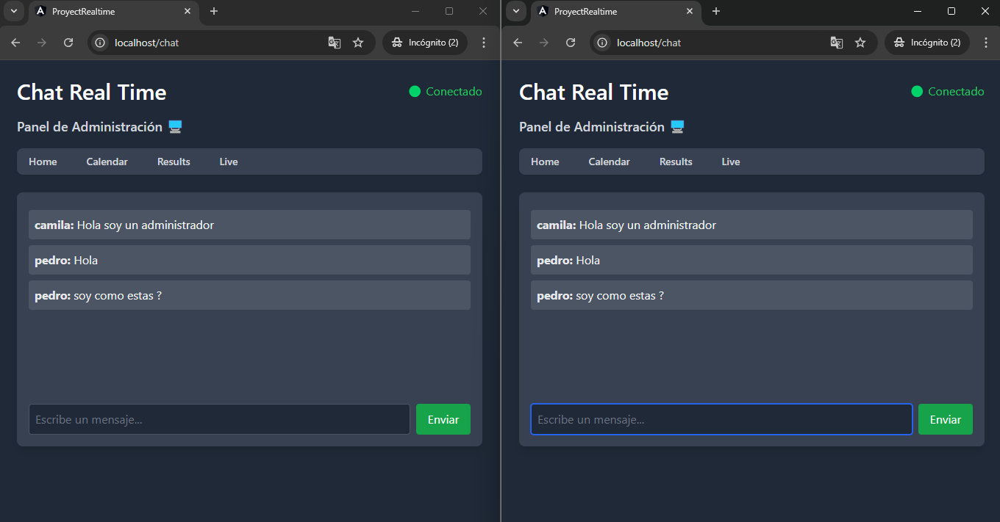

# Instrucciones para Ejecutar con Docker

Para ejecutar esta aplicación utilizando Docker, sigue estos pasos:

### 1. **Clonar el Repositorio**
Primero, clona el repositorio en tu máquina local ejecutando el siguiente comando:
```bash
git clone https://github.com/LuckyDg/Socket-Auth
```
2. **Construir la Imagen de Docker**:
Navega al directorio del proyecto y construye la imagen de Docker ejecutando:
```bash
cd tu-repositorio
docker compose up -d --build
```
Este comando iniciará el contenedor de Docker y mapeará el puerto 80 dentro del contenedor al puerto 80 de tu máquina local.

## Acceder a la Aplicación
Una vez que el contenedor esté en funcionamiento, puedes acceder a la aplicación en tu navegador web dirigiéndote a:

## Credentials Access
Para acceder a la aplicación, usa las siguientes credenciales:

- ADMIN
email: admin@example.com
password: admin123
- USER
email: user@example.com
password: password123

## Imagen de Demo

